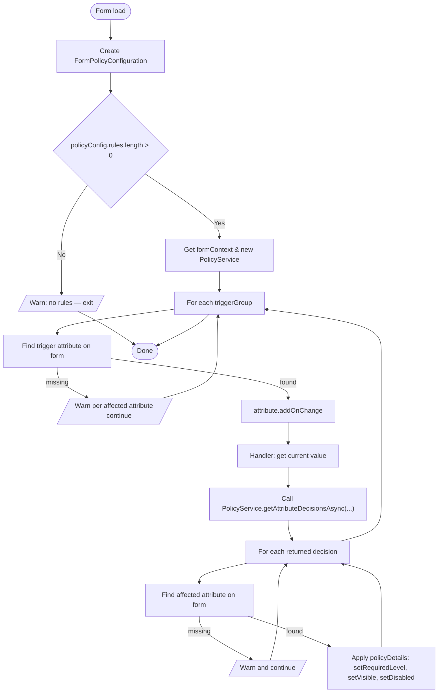

# Form folder

## Purpose

This folder contains form-related entry points and helpers used by the client to apply policy decisions and adjust the UI when a Dataverse form loads.

## Files

- `src/Form/OnLoad.ts` — primary `onLoad` handler that evaluates policy and updates the form/UI.
- `src/Form/index.ts` — barrel file (re-exports form entry points).
- `src/Form/README.md` — this document.

## Behavior

The `onLoad` handler parses the form configuration, wires trigger attributes, and applies policy decisions returned by the `PolicyService` to form controls (required/visible/disabled).

## OnLoad flow (Mermaid)

## Testing

- Unit tests for form logic live in `tests/Form/OnLoad.test.ts`.
- Run the test suite with `npm test` or `npx vitest`.

## Contributing

- When adding new form handlers, follow the existing pattern in `OnLoad.ts` and include unit tests under `tests/Form`.
- Keep handlers small and testable; prefer extracting complex logic into `src/Models` or `src/Services` so it can be unit tested.

## Notes

- The `index.ts` barrel exists to keep imports tidy; this README intentionally ignores its content.
