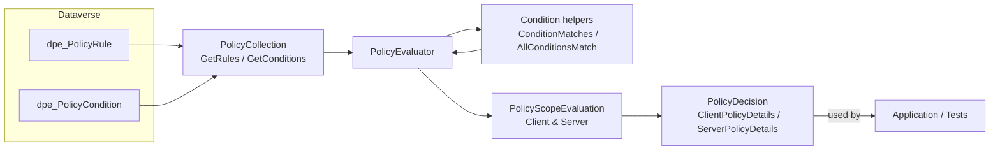

# DataversePolicyEnforcement.Core

Core library containing the policy evaluation engine used to compute attribute-level decisions for Dataverse entities.

Overview
- Implements the evaluation workflow that reads policy rules and conditions from Dataverse, compares trigger values, and produces client- and server-scoped policy outcomes.

Main responsibilities
- Data access: `PolicyCollection` and `IPolicyCollection` query rules and conditions from Dataverse.
- Comparison: `Condition` helpers compare configured condition values against runtime values (`Equals`, `NotEquals`, `IsNull`, `IsNotNull`).
- Evaluation: `PolicyEvaluator` and `PolicyScopeEvaluation` orchestrate rule evaluation and build `PolicyDecision` results (`ClientPolicyDetails`, `ServerPolicyDetails`).
- Model types: lightweight result models live under `Model/` and are used throughout evaluation.

Behavioral notes
- Rules and conditions are filtered to active records and ordered by `dpe_Sequence`.
- Conditions must match for a rule to apply; `NotAllowed = true` short-circuits further evaluation.
- Scopes (`FormOnly`, `ServerOnly`, `Both`) determine whether a rule affects client or server details.

Testing
- Unit tests live in the `DataversePolicyEnforcement.Tests` project. Tests use `FakeXrmEasy` to create in-memory `dpe_PolicyRule` and `dpe_PolicyCondition` records and validate argument handling, filtering, ordering, condition matching, and evaluation semantics.

Notes
- The project targets .NET Framework 4.6.2.
- The evaluation code depends on generated model classes from the `DataversePolicyEnforcement.Models` project; do not edit generated model classes directly.

Architecture diagram

Below is a high-level Mermaid diagram showing how `PolicyEvaluator` orchestrates the core components and data flow:

Notes about the diagram
- `PolicyEvaluator` is the primary entry point: it fetches rules/conditions via `PolicyCollection`, uses `Condition` helpers to evaluate triggers, delegates scoped evaluation to `PolicyScopeEvaluation`, and returns a `PolicyDecision` describing client and server outcomes.

