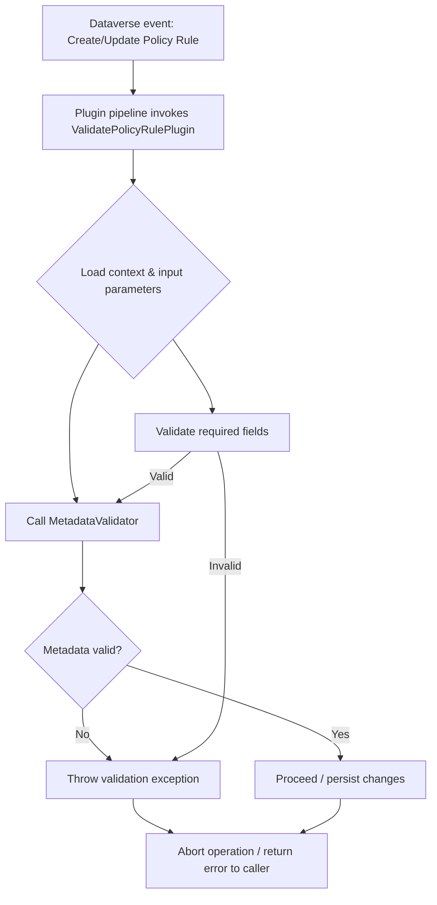
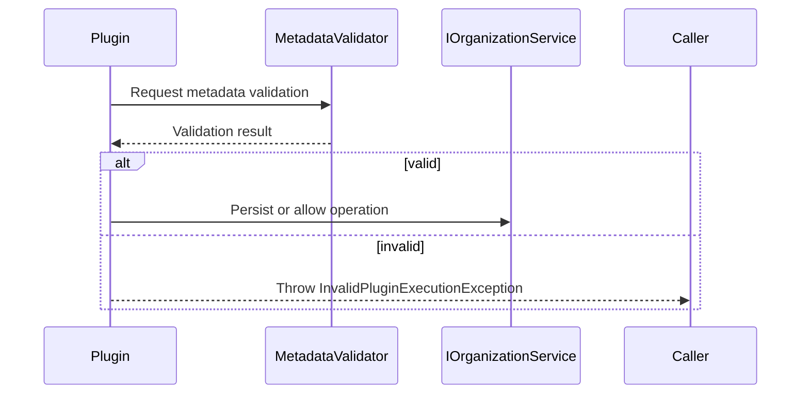

# PolicyRule plugins (high level)

This folder contains the Policy Rule plugin(s) used by the solution to validate policy rule records at runtime.

Overview
- Primary plugin: `ValidatePolicyRulePlugin` — validates incoming Policy Rule records on create/update and enforces metadata/structure constraints.
- Responsibilities:
  - Validate required fields and value formats for policy rule records.
  - Use core helpers (for example `MetadataValidator`) to validate entity metadata or attribute-level constraints.
  - Interact with Dataverse/XRM services via `IOrganizationService` (mocked in unit tests).
  - Throw meaningful plugin exceptions (e.g., `InvalidPluginExecutionException`) when validations fail.

Architecture (high-level)

Flowchart (what happens during execution):

Sequence (interaction with helpers):

Testing
- Unit tests for this plugin live in `DataversePolicyEnforcement.Tests/Plugins/PolicyRule` (see `ValidatePolicyRulePluginTests.cs`).
- Tests use mocks/fakes for `IOrganizationService`, plugin execution context and the metadata validator to remain deterministic.
- Run tests via Visual Studio Test Explorer or `vstest.console.exe` in CI for .NET Framework 4.6.2 projects.

Guidelines for contributors
- Keep plugin logic small and focused; move reusable validation into core helpers (`MetadataValidator`) so it can be unit tested independently.
- Add unit tests for all new validation paths and edge cases.
- Avoid calling live Dataverse in unit tests — use mocking.

Notes
- This README is intentionally high-level. For implementation details see `ValidatePolicyRulePlugin.cs` and related core helpers in `DataversePolicyEnforcement.Core`.
